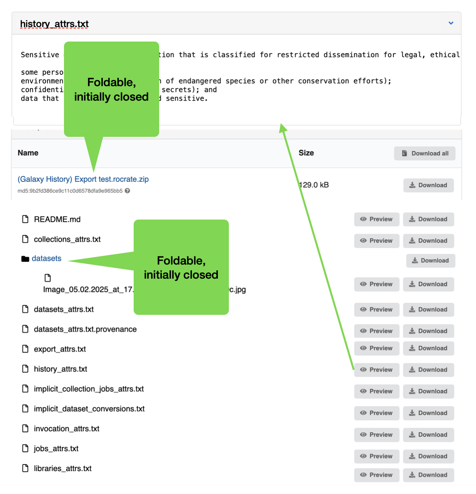

# Support for ZIP and other container formats

- Start Date: 2025-10-01
- RFC PR: `[TBD]`
- Authors: Mirek Simek
- State: DRAFT

## Summary

This RFC proposes adding support for ZIP files and other container file formats. It includes the ability to list archive contents via API and UI, to preview files inside a ZIP archive, and to extract individual files or directories.

## Motivation

ZIP archives and other container formats (e.g., NetCDF) are commonly used to bundle multiple files for distribution and storage. Currently, Invenio does not support listing or extracting the contents of these files. Adding this functionality will enhance the user experience by allowing users to browse and access archive contents directly within the Invenio platform.

This is a feature that is commonly requested by our users.

### User stories

#### Border stones dataset

A user submitted a dataset with thousands of images of border stones packaged as a single ZIP file. The archive contains a hierarchy of folders named after the regions where the stones were found. The user wants to preview images in the UI and download individual images or folders.

#### Multidimensional data

A user submitted a multidimensional dataset packaged as a NetCDF file. The user wants to browse its logical parts and preview some of them as plots/maps.

## User interface

### Preferred approach

Ideally, the UI should show the contents of the ZIP (and other container) file in a hierarchical tree. Users can expand/collapse folders to see contained files. Each file should provide a direct download link.

Example of user interface showing the contents of a ZIP file:



### Interim approach

As a quicker interim step, we will extend the ZIP previewer to add links for downloading files inside the ZIP. The links will point to new API endpoints for extracting files from the archive. Previewing files inside the ZIP will not be supported in this approach.

## Detailed design

### REST API

The API will be extended to support the following operations (HTTP method: GET unless otherwise noted):

- List contents: List the contents of an archive (ZIP or other supported formats). Returns a hierarchical structure of files and directories.

- Extract files: Retrieve specific files or directories from the archive. Enables downloading individual files or groups of files without downloading the entire archive.

| Endpoint | Description |
| --- | --- |
| `<record>/files/<key>/content/entries` | List archive contents |
| `<record>/files/<key>/content/entries/<path>` | Retrieve a file, or a directory as a ZIP stream |

### File metadata

Existing file metadata will be extended with a boolean attribute `container` to indicate if the file is a container format that can be extracted. This attribute is `true` for supported formats (e.g., ZIP, NetCDF) and `false` otherwise.

#### List operation

The list operation is a GET request to `/api/records/<pid_value>/files/<key>/content/entries`. The user must have the `can_get_content_files` permission to call the API. The API returns a JSON response with the following structure:

```json5
{
    "entries": [
        {
            "key": "folder1",
            "title": "Folder 1", // optional
            "type": "directory",
            // other metadata fields can be added here and should be ignored by clients
            // if not recognized
            "entries": [ 
                {
                    "key": "file1.txt",
                    "title": "My text file", // optional
                    "type": "file",
                    "size": 1234, // optional
                    "checksum": "md5:abcd1234", // optional
                    "mime_type": "text/plain", // optional
                    // other metadata fields can be added here and should be ignored by clients
                    // if not recognized
                },
                // ...
            ]
        },
        // ...
    ],
    "total": 42, // total number of entries (files and directories)
    "truncated": false // true if the listing was truncated (e.g., too many entries)
}
```

Note: we do not plan to support pagination for the listing operation, as pagination over a hierarchical structure is difficult to implement. The entire structure will be returned in a single response. The extractor should return the total number of entries and a flag indicating whether the listing was truncated.

#### Extract operation

The extract operation is a GET request to `/api/records/<pid_value>/files/<key>/content/entries/<path>`. The user must have the `can_get_content_files` permission. If `<path>` points to a file, the API streams the file content. If `<path>` points to a directory, the API streams a ZIP archive of that directory.

### Internal API

Most of the backend logic will be implemented inside the `invenio_records_resources` package.

#### `invenio_records_resources.services.files.extractors`

A new module `invenio_records_resources.services.files.extractors` will be created to handle the extraction.

#### `invenio_records_resources.services.files.extractors.base`

```python

from typing import Protocol
from invenio_records_resources.files.api import FileRecord

class SendFileProtocol(Protocol):
    def send_file(self) -> None: ...

class FileExtractor:

    def can_process(self, file_record: FileRecord) -> bool:
        """Determine if this extractor can process a given file record."""

    def list(self, file_record: FileRecord) -> list[dict]:
        """Return a listing of the file."""

    def extract(self, file_record: FileRecord, path: str) -> SendFileProtocol:
        """Extract a specific file or directory from the file record."""
```

#### `invenio_records_resources.services.files.extractors.zip`

This module will implement the `FileExtractor` interface for ZIP files using the `zipfile` module from the Python standard library.

There are two storage scenarios for the ZIP file, and each requires a different processing strategy:

1. Locally stored files — files stored on the local filesystem, where random access to any part of the file is cheap.

2. Remotely stored files — files stored on remote storage backends (e.g., S3, Google Cloud Storage) where random access is expensive because seeks require new connections.

To address both cases, we will add a pre-processing step. After a file is uploaded, a dedicated file processor will check the ZIP file and create an index of the contents. This index will be stored as a separate JSON file inside the associated media files bucket. The index will contain all the information needed for the `list` operation, so the ZIP does not need to be opened for listing.

For remote storage backends, the index will also contain a copy of the ZIP file's table of contents (TOC). When a file from the ZIP is requested, we will use the TOC to instruct the `zipfile` module where the file is located inside the archive. This allows extracting the file in a single operation without additional seeks.

## Previewers

Currently, previewers use a low-level API to access file content. To enable previewing files inside ZIP archives in a backward-compatible way, we will add a compatibility layer that exposes archive entries as regular file-like resources.

## Unresolved questions

- As support for extractors might require both a `FileExtractor` and a `FileProcessor`, would it make sense to have a contrib module that provides both (similar to `invenio_vocabularies.contrib`)?
  - `invenio_records_resources.contrib.extractors.zip`
  - `invenio_records_resources.contrib.extractors.netcdf`
